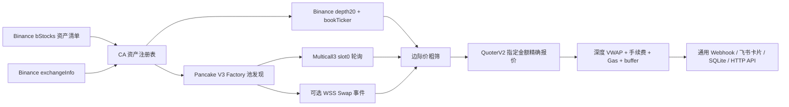

# Binance bStocks 双边价格监听器

一个只读的 TypeScript 监控服务，用 Binance Spot 深度盘口和 PancakeSwap V3 链上报价发现 bStock 跨市场价差。服务不会下单、授权代币或发起转账。

## 工作方式



核心设计：

- 从 Binance bStocks 清单取得 `assetCode`、底层 ticker 和 BSC 合约地址，再与 Spot `exchangeInfo` 的 `baseAsset` 关联，不依赖字符串拼接交易对。
- 同时订阅全部现货交易对的 `bookTicker` 和 `depth20@100ms`。两类数据独立保存：`bookTicker` 只做低成本粗筛，`depth20`/REST snapshot 才用于逐档 VWAP，且分别拒绝乱序 update ID。
- 用 PancakeSwap 官方 V3 Factory 对 `[100, 500, 2500, 10000]` fee tiers 执行 `getPool`，随后验证池的 `token0`、`token1`、fee 和流动性。
- 使用 Multicall3 聚合读取池状态，避免公共 BSC RPC 因大量 `eth_call` 限流。默认每秒更新一次。
- 配置可靠的 `BSC_WSS_URL` 后，会额外监听 Pancake V3 `Swap` 事件，用事件里的成交后 `sqrtPriceX96`、liquidity 和 tick 立即更新边际价；HTTP 轮询仍作为兜底。
- 边际价只用于低成本粗筛。接近阈值时调用 Pancake QuoterV2，对配置的真实金额执行双向 `eth_call`，把 LP fee、价格冲击和 tick 跨越纳入结果。
- 每次 Quoter 精确报价都有总截止时间；CEX→DEX 方向会在链上报价返回后复验 Binance 深度，价格或数量漂移超过阈值就丢弃，避免拼接不同时刻的两条腿。
- 仅使用 Binance 清单里的 CA，且只接受官方 Factory 返回并经链上校验的池，以规避同名假币和假池。

当前实现聚焦直接的 PancakeSwap V3 bStock/USDT 池。实测当前 56 个 Binance bStocks 中，只有部分资产存在活跃的直连池；无池、零 active liquidity 或 Quoter 失败的资产会被自动跳过。

## 两个监控方向

`CEX_BUY_DEX_SELL`：

1. 用 `NOTIONAL_USD` 逐档吃 Binance asks，得到实际买入均价和 bStock 数量。
2. 用同数量调用 Pancake V3 Quoter，计算卖出所得 USDT。
3. 按实际手续费扣款资产处理 Binance taker fee，再扣执行 buffer、Gas 和库存再平衡成本。

`DEX_BUY_CEX_SELL`：

1. 用 `NOTIONAL_USD` 在 Pancake Quoter 模拟买入 bStock。
2. 用所得数量逐档吃 Binance bids。
3. 扣除 Binance taker fee、执行 buffer、Gas 和库存再平衡成本。

输出的 `netBps` 为估算净利润除以 acquisition cost。只有同时达到 `MIN_PROFIT_USD` 和 `ALERT_THRESHOLD_BPS` 才告警。

## 结算模式

默认：

```dotenv
SETTLEMENT_MODE=prepositioned
```

这表示 Binance 和链上钱包两边已预置库存，信号可以被标记为 `actionable=true`。跨平台套利不是原子交易；如果成交后才提现或充值，到账前价格通常已经变化。

如设置：

```dotenv
SETTLEMENT_MODE=transfer
```

程序会根据 Binance 钱包接口检查充值/提现状态及提现费，但所有信号都会标记为 indicative，即 `actionable=false`。此模式适合观察顺序搬砖，不代表可即时锁定利润。

## 快速开始

要求 Node.js 22 或更高版本。PM2 可以全局安装，也可以使用已有的 PM2：

```bash
nvm use
npm ci
cp .env.example .env
npm test
npm run check:live
npm run build
npm start
```

`check:live` 默认验证 TSLAB 的官方池、链上边际价和 1000 USDT 双向 Quoter 输出。检查其他资产：

```bash
CHECK_ASSET=NVDAB npm run check:live
```

## PM2 运行

```bash
npm run pm2:start
pm2 status bstock-monitor
npm run pm2:logs
```

更新代码或 `.env` 后：

```bash
npm run pm2:reload
```

希望重启机器后自动恢复时，再执行：

```bash
pm2 save
pm2 startup
```

PM2 使用 [ecosystem.config.cjs](./ecosystem.config.cjs)，单实例 fork 模式运行 `dist/index.js`，日志写入 `logs/`，内存超过 600 MB 时自动重启。宿主机尚未统一管理日志轮转时，建议配置 PM2 官方 `pm2-logrotate` 模块：

```bash
pm2 install pm2-logrotate
pm2 set pm2-logrotate:max_size 50M
pm2 set pm2-logrotate:retain 14
pm2 set pm2-logrotate:compress true
```

## 关键配置

完整配置见 [.env.example](./.env.example)。最重要的参数：

| 参数 | 默认值 | 说明 |
|---|---:|---|
| `BSC_RPC_URL` | Binance 公共 RPC | 生产环境建议换成低延迟专用 RPC |
| `BSC_WSS_URL` | 空 | 配置后启用 V3 Swap 事件快速路径 |
| `NOTIONAL_USD` | `1000` | 每个方向模拟的 USDT 金额 |
| `PREQUOTE_THRESHOLD_BPS` | `10` | 触发 Quoter 精确验证的粗筛阈值 |
| `ALERT_THRESHOLD_BPS` | `30` | 净收益告警阈值 |
| `MIN_PROFIT_USD` | `1` | 最低美元净利润 |
| `CEX_TAKER_FEE_BPS` | `10` | Binance taker fee 保守估计 |
| `CEX_BUY_FEE_ASSET` | `base` | CEX 买入手续费从收到的 bStock 扣；使用 BNB/quote 支付时改为 `quote` |
| `EXECUTION_BUFFER_BPS` | `5` | Quoter 后额外扣减的执行安全边际 |
| `ESTIMATED_GAS_COST_USD` | `0.20` | 每次链上成交估算 Gas |
| `REBALANCE_COST_USD` | `0` | 每次机会摊销的库存再平衡成本 |
| `DEX_POLL_INTERVAL_MS` | `1000` | 链上池状态兜底轮询间隔 |
| `EXACT_QUOTE_TIMEOUT_MS` | `3000` | 一次双边精确验证的总时间上限 |
| `MAX_LEG_DRIFT_BPS` | `5` | Quoter 前后 CEX 腿允许的最大漂移 |
| `MAX_PRICE_AGE_MS` | `5000` | 数据最大允许年龄 |
| `SNAPSHOT_INTERVAL_MS` | `30000` | SQLite 行情抽样间隔，不影响实时检测频率 |
| `SQLITE_PATH` | `./data/bstock-monitor.db` | SQLite 文件位置 |
| `WEBHOOK_URL` | 空 | 告警时 POST JSON 的通用 webhook |
| `FEISHU_WEBHOOK_URL` | 空 | 飞书群自定义机器人的 Webhook 地址 |
| `FEISHU_WEBHOOK_SECRET` | 空 | 机器人启用签名校验时填写的密钥 |
| `FEISHU_MESSAGE_TITLE` | `bStock 套利告警` | 卡片标题；启用关键词校验时应包含对应关键词 |
| `FEISHU_AT_ALL` | `false` | 告警卡片是否 @ 所有人 |

可选的 `BINANCE_API_KEY`、`BINANCE_API_SECRET` 只用于签名读取 `/sapi/v1/capital/config/getall`。建议使用只有读取权限、没有交易和提现权限的专用 key；程序不会调用交易、提现或资金划转接口。

## 飞书机器人通知

在目标飞书群中打开“群设置 → 群机器人 → 添加机器人 → 自定义机器人”，复制 Webhook 地址。建议同时开启签名校验，并把 Webhook 和密钥写入 `.env`：

```dotenv
FEISHU_WEBHOOK_URL=https://open.feishu.cn/open-apis/bot/v2/hook/xxxxxxxx
FEISHU_WEBHOOK_SECRET=xxxxxxxx
FEISHU_MESSAGE_TITLE=bStock 套利告警
FEISHU_AT_ALL=false
```

如果机器人使用“自定义关键词”安全设置，关键词需要出现在 `FEISHU_MESSAGE_TITLE` 中。配置完成后可主动发送一条连接测试卡片，然后重载服务：

```bash
npm run check:feishu
npm run pm2:reload
```

只有同时达到 `MIN_PROFIT_USD`、`ALERT_THRESHOLD_BPS` 且通过 `ALERT_COOLDOWN_MS` 去重的信号才会通知。卡片包含套利方向、两边成交均价、净利润、收益率、池地址、报价耗时和 Binance/BscScan 快捷入口。通用 `WEBHOOK_URL` 与飞书可以同时配置。

实现支持飞书签名校验，并按官方限制控制在每机器人 5 次/秒、100 次/分钟；11232、HTTP 429/5xx 和短暂网络故障会有限重试。请求体保持远低于 20 KB。详见[飞书自定义机器人使用指南](https://open.feishu.cn/document/ukTMukTMukTM/ucTM5YjL3ETO24yNxkjN?lang=zh-CN)。

## HTTP 与 Prometheus

默认只监听 `127.0.0.1:8787`：

```bash
curl http://127.0.0.1:8787/health
curl http://127.0.0.1:8787/v1/assets
curl http://127.0.0.1:8787/v1/markets
curl 'http://127.0.0.1:8787/v1/opportunities?source=history&limit=100'
curl http://127.0.0.1:8787/metrics
```

- `/health`：CEX WebSocket、DEX block、池数量、SQLite 统计。
- `/v1/assets`：Binance ticker、CA、已验证池和充值提现状态。
- `/v1/markets`：当前 CEX bid/ask 与 DEX 边际买卖价。
- `/v1/opportunities`：内存中的最新结果；加 `source=history` 查询 SQLite。
- `/metrics`：可供 Prometheus 抓取的基础指标。

## SQLite

SQLite 使用 WAL 模式，仅按 `SNAPSHOT_INTERVAL_MS` 保存抽样行情，不会把每个 WebSocket tick 写盘。表包括：

- `assets`：ticker、CA、交易对及 multiplier。
- `pools`：已验证的 PancakeSwap V3 池。
- `price_snapshots`：CEX/DEX 周期快照。
- `opportunities`：达到 `MIN_PROFIT_USD` 的精确报价结果。

数据默认每 30 秒抽样并保留 14 天，由 `SNAPSHOT_INTERVAL_MS`、`RETENTION_DAYS` 控制。过期记录以 5,000 行为一批删除，批次间会让出事件循环，避免清理历史时阻塞行情处理。

## Multiplier 处理

bStocks 实现 ERC-8056 Scaled UI Amount。标准 ERC-20 操作、Pancake 池和 Binance bStock 交易使用的是同一 token amount，因此跨场所数量比较不额外乘除 multiplier。程序仍会同时读取 Binance 的 `ml` 和链上 `uiMultiplier()`，在公司行动导致 multiplier 或 CA 变化时记录警告并刷新池注册表。

## 已知边界

- 当前 Quoter 会比较所有直连 V3 fee-tier 池并选择最佳单池输出，尚未实现 Smart Router 的拆单、多跳、V2 或 Infinity 路由。
- Binance 手续费使用配置的保守 taker bps；默认假设 BUY commission 从 base 扣除并据此减少可在 DEX 卖出的数量。启用 BNB 抵扣或 quote 扣费时应把 `CEX_BUY_FEE_ASSET` 改为 `quote`。
- `depth20` 不足以覆盖配置金额时，机会会失效，而不是外推盘口。
- 程序没有检查实际账户余额、链上 allowance、nonce、MEV、交易失败概率或对手方风险，因此 `actionable` 仍然只是监控标签。
- 充值/提现状态不等于跨平台成交可原子结算。依赖转账的结果始终是 indicative。
- 这是技术监控工具，不构成投资建议；使用前需确认所在司法辖区对 tokenized securities 的限制。

## 主要技术依据

- [Binance Spot WebSocket Streams](https://developers.binance.com/docs/binance-spot-api-docs/web-socket-streams)
- [Binance Spot Exchange Information](https://developers.binance.com/docs/binance-spot-api-docs/rest-api/general-endpoints)
- [Binance Wallet All Coins Information](https://developers.binance.com/docs/wallet/capital/all-coins-info)
- [PancakeSwap V3 contract addresses](https://developer.pancakeswap.finance/contracts/v3/addresses)
- [PancakeSwap V3 pool contract](https://docs.pancakeswap.finance/developers/smart-contracts/pancakeswap-exchange/v3-contracts/pancakev3pool)
- [ERC-8056 Scaled UI Amount](https://eips.ethereum.org/EIPS/eip-8056)
